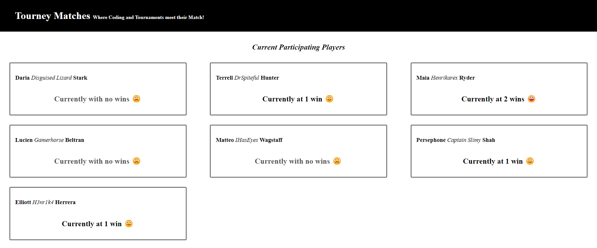
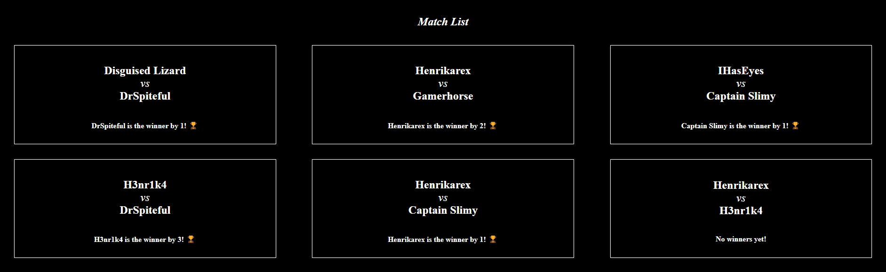

# 🕹️ Tourney Matches

React project based on managing small game tournaments (like Super Smash Bros) 🎮

### Project Focus:  
* Practice passing down props to children elements 🏒
* Refine understanding of `props.children` 🐣
* Additional practice playing with data structures 🏗️

## Final Product

## Purpose

This project was created by [me](https://github.com/kazvee) as part of my learnings at [Lighthouse Labs](https://www.lighthouselabs.ca/en/web-development-flex-program).

## Dependencies

- [React](https://react.dev/)
- [react-dom](https://legacy.reactjs.org/docs/react-dom.html)
- [Node](https://nodejs.org) v5.10.x or above

## A note about `create-react-app`

For larger, production-ready applications, React's official documentation and best practices now recommend other ways to [Start a New React Project](https://react.dev/learn/start-a-new-react-project). 
This was a project for learning purposes, with no plans to scale this project out or add further customization, so [create-react-app](https://github.com/facebook/create-react-app) provided a simple way to quickly get a functional React app up and running

## Getting Started

- Fork this repository to your own GitHub account
- Clone your fork onto your local device
- Install all dependencies using the `npm i` (or `npm install`) command
- Start the web server using the `npm start` command. The app will be served at [http://localhost:3000](http://localhost:3000/)
- Navigate to [http://localhost:3000](http://localhost:3000/) in your browser